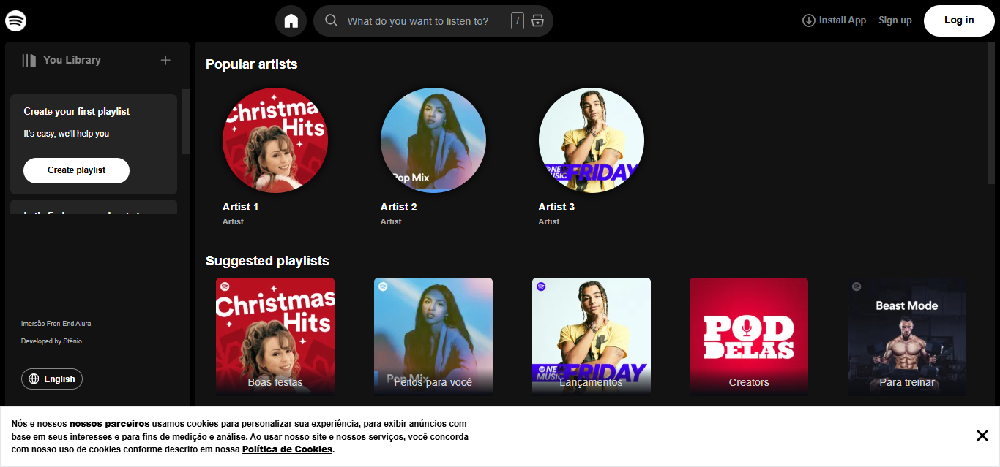
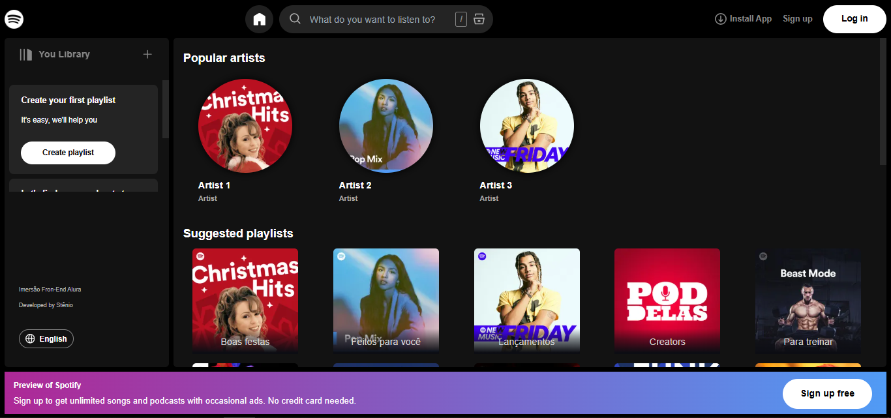
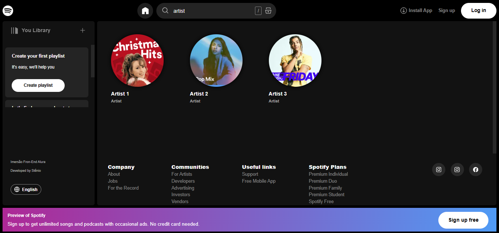
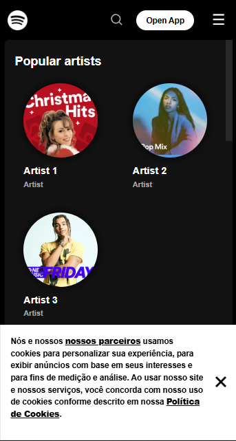

# Clone - Spotify
Imersao FrontEnd Alura

Developed by [Stenio](https://github.com/stenioeinstein-dev)

### Feito em Nextjs

#### Este é um projeto desenvolvido em [Next.js](https://nextjs.org/).

A ideia por trás deste projeto é desenvolver e aprender conceitos do frontend. O projeto tem uma finalidade educacional para promover as habilidades adquiridas em programação/desenvolvimento.

```bash
Projeto desenvolvido durante a Imersão Frontend Alura
```

##### Imagem em formato desktop.

 


##### Imagem em formato mobile.



